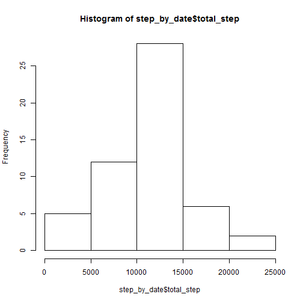
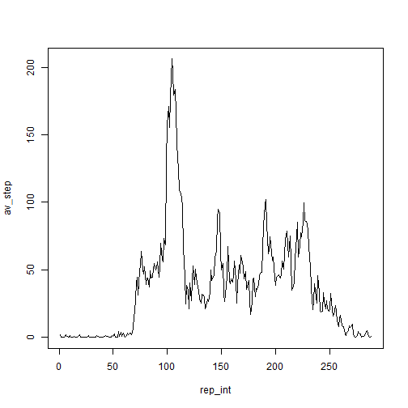
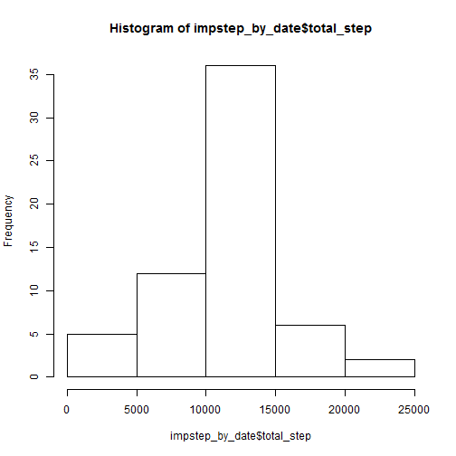
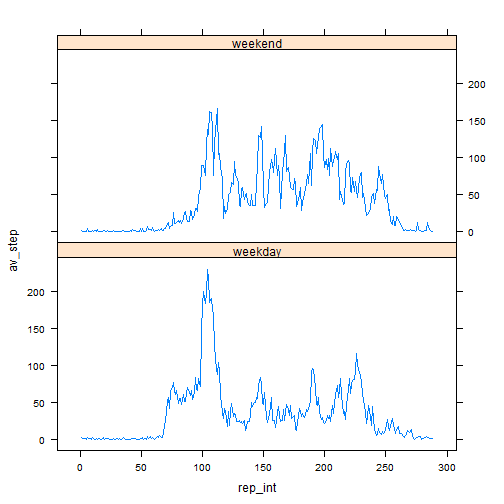

#Load and preprocessing the data.
I store the data in "act".
I change the strings in date to standard date format.

```r
library(dplyr)
library(lubridate)
Sys.setlocale("LC_ALL", "English")
```

```
## [1] "LC_COLLATE=English_United States.1252;LC_CTYPE=English_United States.1252;LC_MONETARY=English_United States.1252;LC_NUMERIC=C;LC_TIME=English_United States.1252"
```

```r
act <- read.csv("./activity.csv")
act$date <- ymd(act$date)
```

#Mean total number of steps per day

```r
act_by_date <- group_by(act, date)
step_by_date<- summarize(act_by_date, total_step = sum(steps))
hist(step_by_date$total_step)
```

 

```r
mean(step_by_date$total_step, na.rm = TRUE)
```

```
## [1] 10766.19
```

```r
median(step_by_date$total_step, na.rm = TRUE)
```

```
## [1] 10765
```

#Average daily activity pattern
For simplicity, I use repeated vector from 1 to 288 for 61 times to replace the time interval. This will allow me to group by repeated time. It could be better if it is a natural time (i.e. hours and minuites).

```r
interval_count <- summarize(act_by_date, n())[2]
act_by_interval <- mutate(act, rep_int = rep(1:288, 61))
actby_rep_int <- group_by(act_by_interval, rep_int)
daily_step <- summarize(actby_rep_int, av_step = mean(steps, na.rm = TRUE))
plot(daily_step, type = "l")
```

 

```r
filter(daily_step, av_step == max(av_step))
```

```
## Source: local data frame [1 x 2]
## 
##   rep_int  av_step
##     (int)    (dbl)
## 1     104 206.1698
```
The max step occurs during the 104th interval in a day, which is 8:35am to 8:40am.

#Imputing missing values
I tested steps along time and found it would be better to impute using daily activity pattern, since it is very replicable. I used a trick. As mentioned in the last section, the time interval has been replaced with repeated 1:288, so I can used the interval value from the rows with NA step to fetch average value from the daily activity data frame.
As we can see here, after this imputation, there is no great difference between the un-imputed and the imputed sets.

```r
sum(is.na(act$steps))
```

```
## [1] 2304
```

```r
act_imputed <-actby_rep_int
#trick!!!
act_imputed$steps[is.na(act_imputed$steps)] <- daily_step$av_step[act_imputed$rep_int[is.na(act_imputed$steps)]]
imp_by_date <- group_by(act_imputed, date)
impstep_by_date<- summarize(imp_by_date, total_step = sum(steps))
hist(impstep_by_date$total_step)
```

 

```r
mean(impstep_by_date$total_step)
```

```
## [1] 10766.19
```

```r
mean(step_by_date$total_step, na.rm = TRUE)
```

```
## [1] 10766.19
```

```r
median(impstep_by_date$total_step)
```

```
## [1] 10766.19
```

```r
median(step_by_date$total_step, na.rm = TRUE)
```

```
## [1] 10765
```

#Difference between weekdays and weekends
As we can see, on weekdays subjects are more active through out the whole day than on weekends.

```r
act_imputed$wd <- factor(weekdays(act_imputed$date) %in% c("Saturday", 
"Sunday"), levels=c(FALSE, TRUE), labels=c("weekday", "weekend"))
imp_wd <- group_by(act_imputed, wd, rep_int)
wd_step <- summarize(imp_wd, av_step = mean(steps))
library(lattice)
xyplot(av_step~rep_int | wd,wd_step, type = "l", layout=c(1,2))
```

 
